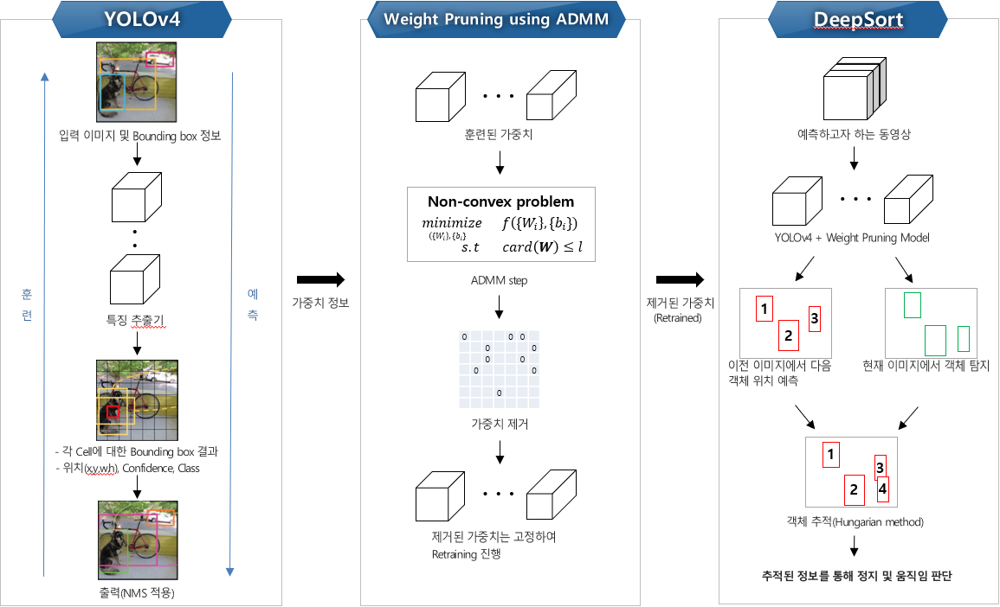

# CCTV-Compression(YOLOv4 + Deepsort + Pruning)
- YOLOv4를 사용하여 객체 탐지(Bounding box, Classification)
- 탐지된 객체 정보를 통해 Deepsort를 사용하여 원하는 객체의 정지 상태나 움직임을 식별
- 식별된 움직임 정보를 통해 움직임이 없는 상태를 제거하여 저장 용량 축소
- ADMM 기반의 Weight Pruning 기법을 사용하여 객체 탐지 모델 경량화
<br/>
<p align="center"></p>

<br/>
## 시작하기

### 선행 설치 조건

- CUDA Toolkit version은 10.1을 권장

```
tensorflow-gpu==2.3.0rc0
opencv-python==4.1.1.26
lxml
tqdm
absl-py
matplotlib
easydict
pillow
```

### Conda
```
# Tensorflow CPU
conda env create -f conda-cpu.yml
conda activate yolov4-cpu

# Tensorflow GPU
conda env create -f conda-gpu.yml
conda activate yolov4-gpu
```

### 학습된 YOLOv4 weights 가져오기(COCO로 학습)
- https://drive.google.com/open?id=1cewMfusmPjYWbrnuJRuKhPMwRe_b9PaT 에서 다운로드한 파일을 YOLOv4/data/ 경로에 추가
- 직접 학습시키고자 할 경우 'YOLOv4 훈련' 파트부터 실행

## YOLOv4
### YOLOv4 훈련
- 훈련 파라미터는 YOLOv4/core/config.py에서 수정
- 데이터는 COCO dataset 기준이며 다른 데이터에 적용하기 위해서는 YOLOv4/data/dataset/val2017.txt 파일과 같이 수정 필요
- val2017.txt의 형태 : (이미지경로 x1,y1,x2,y2,class_label ...), class 정보는 YOLOv4/data/classes/ 경로에 위치(config.py에서 수정 필요)
```
python train.py
```

<br/>
### YOLOv4 예측
#### 1) 학습된 YOLOv4 weights 사용하여 예측
```
python save_model.py --weight_origin True
python detect.py --weights ./checkpoints/yolov4-416 --image ./data/kite.jpg
```
#### 2) 새로운 데이터로 학습시킨 weights를 사용하여 예측
```
python save_model.py
python detect.py --weights ./checkpoints/yolov4-416 --image ./data/kite.jpg
```

## 파일 설명
#### 1) preprocessing.ipynb \& preprocessing_Ensemble.ipynb

    빈 텍스트 제거, Stop word 제거, 품사 태깅

#### 2) Sentence_classification.ipynb

    벡터화(Word2Vec, Doc2Vec, Fasttext) 및 분류 모델(LSTM, 1D-CNN, XGBoost) 생성

#### 3) sentence_utility.py

    1), 2)에 필요한 함수 구현

#### 4) Associative_classification(TBM).ipynb

    연관 분류 모델('Associative classification based on the Transferable Belief Model') 생성 

#### 5) Predict.ipynb

    생성된 모델들을 통해 적용 및 성능 평가

## 기여자

* [양동욱](dongwook412@naver.com)
* [황보성훈](thehb01@gmail.com)
